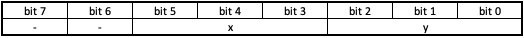
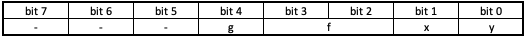

# Screen 

Notre écran s'utilise à l'aide de l'appel system "_scall 5_". \
Pour pouvoir l'utiliser il est nécessaire d'avoir _PySide6_ :

```bash
$ pip install pyside6
```

## screen.py
Cet écran a été conçu principalement pour réaliser des dessins ou des graphiques, il n'est pas réellement adapté pour afficher une image monochrome.

_Exemple avec `square.asm`:_

<p align="center">
  
</p>


#### Initialisation 
La première ligne de la mémoire, adresse `0x00000000`, permet d'initialiser l'écran.

Registre d'initialisation :

<p align="center">
  
</p>

- `f` : Facteur de taille, permet d'agrandir la taille d'un pixel
- `x` : Nombre de pixels en largeur
- `y` : Nombre de pixels en hauteur 

#### Affichage
Si l'écran est initialisé avec _n_ pixel, alors les _n_ lignes qui suivent le registre d'initialisation sont reservées à la mémoire. 
C'est un écran monochrome, au moment de l'initialisation tous les pixels sont configurés en blanc. Il y a seulement les pixels donnés en mémoire à la suite du registre d'initialisation qui seront de couleur noir.

Registre d'affichage :

<p align="center">
  
</p>

- `x` : Position x du pixel à mettre en noir
- `y` : Position y du pixel à mettre en noir
  
Par exemple si on veut le pixel en _x=5_ et _y=5_ alors on doit mettre en mémoire: `0x00005005`


## screen_v0.py

Cet écran est le premier que nous avons réalisé, il a été conçu spécialement pour réaliser des jeux. Notamment pour une bataille navale que l'on avait prévu de réaliser. \
A chaque modification de la mémoire, l'écran réalise une lecture des registres et affiche ses modifications. 

Cet écran fonctionne, quand on réalise une modification de la mémoire à la main et qu'on l'enregistre. Les modifications sont bien apportées sur l'écran. \
Contrairement à l'ISS, ce problème vient de notre méthode de lecture et d'écriture dans la mémoire. Dans notre fichier `memory.cpp`, on ouvre une seule fois la mémoire, quand on écrit dedans, les modifications sont bien réalisées. Mais comme on ne le ferme jamais 
les modifications ne sont pas enregistrées, elles restent dans le buffer, alors l'écran ne peut pas détecter une modification. Il aurait fallu modifier notre méthode ; ouvrir et fermer la mémoire à chaque modification, mais par manque de temps nous n'avons pas pu réaliser ces modifications.

<p align="center">
  
  
</p>

#### Initialisation 
La première ligne de la mémoire, adresse `0x00000000`, permet d'initialiser l'écran.

Registre d'initialisation :

<p align="center">
  
</p>

- `g` : Affichage d'une grille
- `f` : Facteur de taille, permet d'agrandir la taille d'un pixel
- `x` : Nombre de pixels en largeur
- `y` : Nombre de pixels en hauteur 

#### Affichage
Si l'écran est initialisé avec _n_ pixel, alors les _n_ lignes qui suivent le registre d'initialisation sont reservées à la mémoire. 
C'est un écran monochrome, au moment de l'initialisation, tous les pixels sont configurés en blanc. Il y a seulement les pixels donnés en mémoire à la suite du registre d'initialisation qui seront de couleur noir.

Registre d'affichage :

<p align="center">
  
</p>

- `x` : Position x du pixel à mettre en couleur
- `y` : Position y du pixel à mettre en couleur
- `color` : Couleur du pixel en hexadécimal

Par exemple si on veut le pixel en _x=5_ et _y=5_ de couleur _gris_ alors on doit mettre en mémoire: `0x55E8E9EB`
